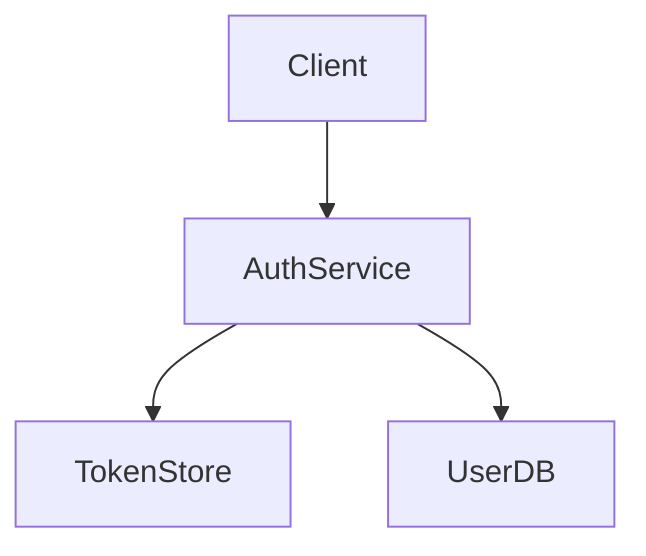

# CONTRACT-AUTH.1.0

Authentication contract for user login and session management.

## Purpose

Provide secure authentication with JWT tokens.

## Scenarios

Given valid credentials
When user logs in
Then session token is created
And token expires after 24 hours

## Architecture



## API

```yaml
openapi: 3.0.0
paths:
  /login:
    post:
      summary: Authenticate user
      requestBody:
        required: true
        content:
          application/json:
            schema:
              type: object
              properties:
                email:
                  type: string
                password:
                  type: string
      responses:
        '200':
          description: Login successful
          content:
            application/json:
              schema:
                type: object
                properties:
                  token:
                    type: string
```

## Data Model

```json
{
  "$schema": "http://json-schema.org/draft-07/schema#",
  "type": "object",
  "properties": {
    "userId": {
      "type": "string",
      "format": "uuid"
    },
    "email": {
      "type": "string",
      "format": "email"
    },
    "roles": {
      "type": "array",
      "items": {
        "type": "string"
      }
    }
  },
  "required": ["userId", "email"]
}
```

## Implementation

Implemented in:
- `auth/service.go`
- `auth/token.go`

## Testing

T2 package tests in `auth/service_test.go`
